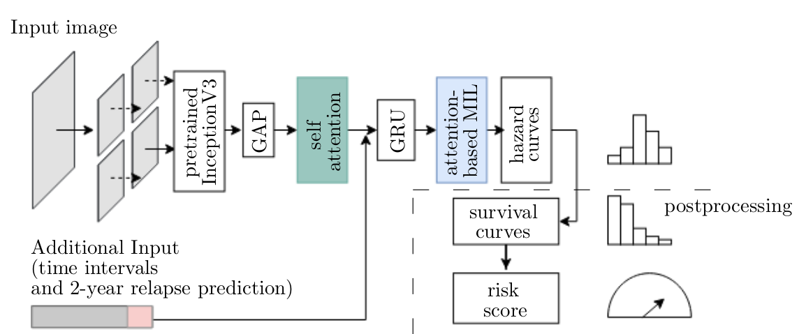

# eCaReNet
This code is for eCaReNet: explainable Cancer Relapse Prediction Network. (Towards Explainable End-to-End Prostate 
Cancer Relapse Prediction from H&E Images Combining Self-Attention MultipleInstance Learning with a Recurrent Neural 
Network, Dietrich, E., Fuhlert, P., Ernst, A., Sauter, G., Lennartz, M., Stiehl, H. S., Zimmermann, M., Bonn, S. -
 ML4H 2021)

eCaReNet takes histopathology images (TMA spots) as input and predicts a survival curve and a risk score for individual 
patients. The network consists of an optional self-attention layer, an RNN and an attention based Mulitple Instance 
Learning module for explainability. To increase model performance, we suggest to include a binary prediction of a 
relapse as input to the model. 

## TL;DR 
- store your dataset information in a .csv file
- make your own my_config.yaml, following the example in config.yaml

- run ```$ python train_model.py with my_config.yaml ```    

## Requirements and Installation
- Python and Tensorflow
  - Use docker to install python, tensorflow, ... (See below and https://docs.docker.com/engine/install/ubuntu/)
  - OR 
  - install tensorflow-gpu manually and all requirements in docker_context/requirements_long.pip
- npm install -g omniboard to view results in browser and inspect experiments 

## Data preprocessing
All annotations of your images need to be stored in a .csv file with the image path and annotations as columns. You need
separate csv files for your training, validation and test sets. Here is an example:

img_path | censored | relapse_time | survived_2years |ISUP_score 
---------|----------|--------------|-----------------|---------
img1.png |0         |80.3          |1                |3    

The columns can be named as you wish, you need to tell python which columns to use in the config file &#8595;

## config file
The config file (config.yaml) is needed to define the directories where the images and training, validation and test 
.csv files are stored. Further, you can choose whether to train a classification (for M_ISUP or M_Bin) or the survival 
model eCaReNet, which loss function and optimizer to use. Also the preprocessing is defined here (patching, resizing, ...)
Details are found in config.yaml. It is best to create a custom my_config.yaml file and run the code as 
    
    $ python train_model.py with my_config.yaml 
You can also change single parameters in the command line like

    $ python train_model.py with my_config.yaml general.seed="13" 

## Training procedure
As recommended in our paper, we suggest to first train M_ISUP with config_isup.yaml. So train your base network 
(Inception or other) on a classification task as a transfer learning task. Second, train a binary classifier with 
config_bin.yaml, choose an appropriate time point to base the decision on. Here, you need to load the pretrained model
from step one, do not load Inception or other keras models. For the third step the prediction from model two M_Bin are 
needed, so please store the information in the .csv file. Then again, load model from step one, and this time include 
the predictions as additional input and train. 

## Unittests
For most functions, a unittest is given in the test folder. This can be used to test if the function works correctly 
after adapting it (e.g. add more functionality or speed up). Further, it can be used for debugging to find errors or 
to find out what the function is actually doing. This is faster than running the whole code.

## Docker
In the docker_context folder, the Dockerfile and requirements are stored. To build a docker image run
    
    $ "docker build -t IMAGE_NAME:DATE docker_context"
    $ docker build  -t ecarenet_docker:2021_10 docker_context
To use the image, run something like the following. Needs to be adapted to your own paths and resources 

    $ docker run --gpus=all --cpuset-cpus=5,6 --user `id --user`:`id --group` -it --rm -v /home/UNAME/PycharmProjects/ecarenet:/opt/project -v /PATH/TO/DATA:/data --network NETWORK_NAME--name MY_DOCKER_CONTAINER ecarenet_docker:2021_10 bash

More information on docker can be found here: https://docs.docker.com/get-started/ 

## sacred
We use sacred (https://sacred.readthedocs.io/en/stable/) and a MongoDB 
(https://sacred.readthedocs.io/en/stable/observers.html https://www.mongodb.com/) to store all experiments. For each 
training run, a folder with an increasing id will be created automatically and all information about the run will be 
stored in that folder, like resulting weights, plots, metrics and losses. Which folder this is, is written in 
settings/default_settings and in the config in training.model_save_path. 

The code works without mongodb, if you want. All results will be stored. If you do want to use the mongodb, 
you need to run a docker container with a 
mongoDB:

    $ docker run -d -p PORTNUMBER:27017 -v ./my_data_folder:/data/db --name name_of_my_mongodb mongo
Create a network:

    $ docker network create NETWORK_NAME
Attach container to network
    
    $ docker network connect NETWORK_NAME name_of_my_mongodb
    
Then during training, the --network NETWORK_NAME property needs to be set. Use omniboard to inspect results:

    $ omniboard -m localhost:PORTNUMBER:sacred

## Tensorflow
Using tensorflow tf.data speeds up the data generation and preprocessing steps. If the dataset is very large, it can be 
cached with tf.cache() either in memory or to a file with tf.cache('/path/to/folder/plus/filename') 
[in dataset_creation/dataset_main.py]. Using tensorflow, it is also best to not overly use numpy functions or to 
decorate them with tf.function. Functions decorated with @tf.function will be included in the tensorflow graph in the 
first step and not be created again and again. For debugging, you need to remove the tf.function decorator, 
because otherwise the function (and breakpoints inside) will be skipped.